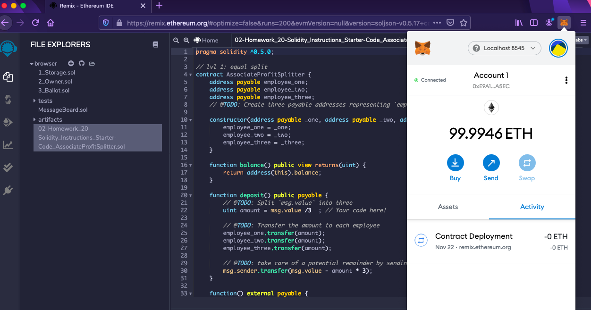

# Building Smart Contracts Using Solidity

#### In this homework assignment, I built a few smart contracts to do the following for the new company I was just hired at:

- Automate some company finances to make everyone's lives easier
- Increase transparency
- Make accounting and auditing practically automatic! 

#### Using Solidity, I built these smart contracts specifically for the following tasks:

- Pay the Associate-level employees quickly and easily

- Distribute profits to different tiers of employees

- Distribute company shares for employees in a "deferred equity incentive plan" automatically

## Instructions

#### This assignment had 3 levels of difficulty, with each contract increasing in complexity and capability. Starting with Level 1:

Level One is an Associate Profit Splitter contract. This will accept Ether into the contract and divide the Ether evenly among the associate level employees. This will allow the Human Resources department to pay employees quickly and efficiently.

Level Two is a Tiered Profit Splitter that will distribute different percentages of incoming Ether to employees at different tiers/levels. For example, the CEO gets paid 60%, CTO 25%, and Bob gets 15%.

Level Three is a Deferred Equity Plan that models traditional company stock plans. This contract will automatically manage 1000 shares with an annual distribution of 250 over 4 years for a single employee.

### Level One:

I went ahead and used Remix IDE to create a new contract called AssociateProfitSplitter.sol using the starter code provided.

While developing and testing the contract, I used the Ganache development chain and pointed my MetaMask to localhost:8545 in order to connect properly.

In more detail, I wrote the following code:

At the top of your contract, you will need to define the following public variables:

employee_one -- The address of the first employee. Make sure to set this to payable.

employee_two -- Another address payable that represents the second employee.

employee_three -- The third address payable that represents the third employee.

Create a constructor function that accepts:

address payable _one

address payable _two

address payable _three

Within the constructor, set the employee addresses to equal the parameter values. This will allow you to avoid hardcoding the employee addresses.

Next, create the following functions:

balance -- This function should be set to public view returns(uint), and must return the contract's current balance. Since we should always be sending Ether to the beneficiaries, this function should always return 0. If it does not, the deposit function is not handling the remainders properly and should be fixed. This will serve as a test function of sorts.

deposit -- This function should set to public payable check, ensuring that only the owner can call the function.

In this function, perform the following steps:

Set a uint amount to equal msg.value / 3; in order to calculate the split value of the Ether.

Transfer the amount to employee_one.

Repeat the steps for employee_two and employee_three.

Since uint only contains positive whole numbers, and Solidity does not fully support float/decimals, we must deal with a potential remainder at the end of this function since amount will discard the remainder during division.

We may either have 1 or 2 wei leftover, so transfer the msg.value - amount * 3 back to msg.sender. This will re-multiply the amount by 3, then subtract it from the msg.value to account for any leftover wei, and send it back to Human Resources.

Create a fallback function using function() external payable, and call the deposit function from within it. This will ensure that the logic in deposit executes if Ether is sent directly to the contract. This is important to prevent Ether from being locked in the contract since we don't have a withdraw function in this use-case.

### Level Two:

In this contract, rather than splitting the profits between Associate-Level employees, I went ahead and calculated the rudimentary percentages for different tiers of employees (CEO, CTO, and Bob).

Using the starter code, within the deposit function, I wrote the following code:

Calculate the number of points/units by dividing msg.value by 100.

This will allow us to multiply the points with a number representing a percentage. For example, points * 60 will output a number that is ~60% of the msg.value.

The uint amount variable will be used to store the amount to send each employee temporarily. For each employee, set the amount to equal the number of points multiplied by the percentage (say, 60 for 60%).

After calculating the amount for the first employee, add the amount to the total to keep a running total of how much of the msg.value we are distributing so far.

Then, transfer the amount to employee_one. Repeat the steps for each employee, setting the amount to equal the points multiplied by their given percentage.

### Step 1: amount = points * 60;

For employee_one, distribute points * 60.

For employee_two, distribute points * 25.

For employee_three, distribute points * 15.

### Step 2: total += amount;

### Step 3: employee_one.transfer(amount);

Send the remainder to the employee with the highest percentage by subtracting total from msg.value, and sending that to an employee.

The provided balance function can be used as a test to see if the logic you have in the deposit function is valid. Since all of the Ether should be transferred to employees, this function should always return 0, since the contract should never store Ether itself.

Note: The 100 wei threshold is due to the way we calculate the points. If we send less than 100 wei, for example, 80 wei, points would equal 0 because 80 / 100 equals 0 because the remainder is discarded. We will learn more advanced arbitrary precision division later in the course. In this case, we can disregard the threshold as 100 wei is a significantly smaller value than the Ether or Gwei units that are far more commonly used in the real world (most people aren't sending less than a penny's worth of Ether).
